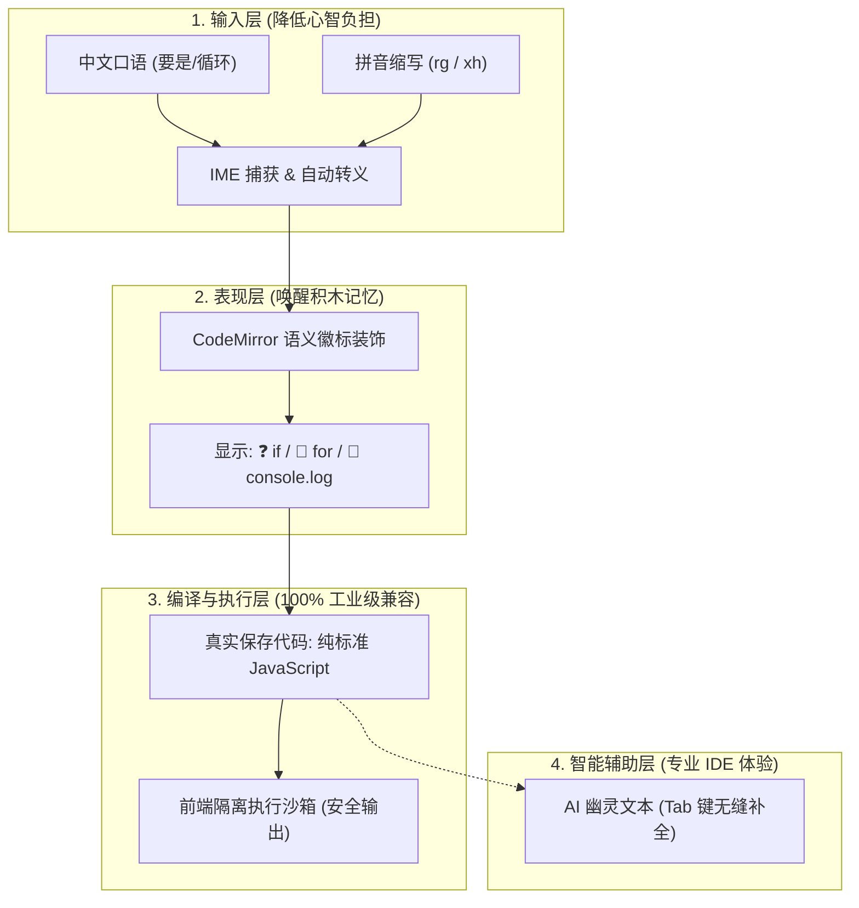

# 访谈研究 01：全球开源生态与竞品差异化调研

> **研究主题**：GitHub 全球开源生态类似项目检索与差异化定位  
> **归档位置**：`.gemini/01_COMPETITIVE_LANDSCAPE.md`  
> **记录形式**：深度访谈纪要与行业生态调研分析

---

## 🎙️ 访谈实录

**研究员（Interviewer）**：  
在我们启动当前原型项目时，首要关注的问题是：在 GitHub 及全球开源社区中，是否存在类似的产品？现有的生态格局是怎样的？

**架构专家（Expert）**：  
经过对 GitHub、NPM 及各大 IDE 插件市场的全面扫描与模式检索，目前全球开源社区**没有与我们完全一致的同构项目**。市面上的相关探索主要分散在四个相对独立的切片领域：

### 1. Emoji 编程语言流派（Emoji-as-Syntax）
* **代表项目**：
  * `emojicode/emojicode`（3k+ Stars，多范式编译型语言，语法全部由 Emoji 组成，如 `🍇 ... 🍉` 代表代码块，`😀` 代表打印输出）。
  * `lwgray/emojiscript`、`harsh-baranwal/the-emojiscript`（基于 Python/Node 的玩具解释器）。
  * `krauzX/emoji-script`（将 Emoji 语法通过 AST 转译为 JavaScript 的跨编译器）。
* **本质特征**：代码本身保存为 Unicode Emoji 符号，必须依赖特定的定制编译器或虚拟机运行，**无法直接在工业界标准运行时中执行**，娱乐性质远大于生产与教学实用价值。

### 2. 拼音与中文代码补全流派（Pinyin Code Completion）
* **代表项目**：
  * VS Code 插件 `chinese.vscode-zh-completion`（星汉）。
  * JetBrains 插件 `ChinesePinyin-CodeCompletionHelper`。
  * `wenyan-lang/wenyan`（文言文转译语言）。
* **本质特征**：绝大部分插件的核心诉求是“补全中文变量名/标识符”（例如写中文拼音联想出中文命名的变量），或者做智能输入法中英文状态切换；而像文言文编程则是文化实验性质的转译器，并未聚焦现代通用编程的输入心智减负。

### 3. 编辑器关键字符号装饰（Visual Code Decoration）
* **代表技术**：
  * VS Code `Pretty Symbols` / `Pretty TypeScript`。
  * CodeMirror 6 的 `Decoration.widget` 与 `Decoration.replace`。
* **本质特征**：利用编辑器的修饰层将代码中的抽象字符（如 `function`、`=>`）在屏幕上渲染为数学符号（如 `λ`、`→`），文本底层保持源码不变。但这类插件主要面向具有较高数学素养的资深开发者，缺少针对入门者的具象引导。

### 4. 现代 Web 轻量级交互沙箱与 AI 补全
* **代表技术**：CodeSandbox Sandpack、WebContainer、CodeMirror 6 Inline Completion。
* **本质特征**：具备浏览器端免配置即时执行能力与 AI 辅助能力，是现代 WebIDE 的标配底座。

---

## 💡 深度分析：本项目的首创性与生态位

**研究员（Interviewer）**：  
那么，当前项目的核心护城河与差异化创新体现在哪里？

**架构专家（Expert）**：  
本项目的精妙之处在于**将上述孤立技术切片进行了创造性的重构融合**，形成了独特的闭环：

### 核心反差优势总结：
1. **“表里不一”的工程设计**：表面上看似趣味横生的 Emoji 图标与拼音直出，**底层却 100% 遵从 ECMAScript 规范**。它既具备“玩具语言”的亲和力，又拥有“正规工程代码”的严肃性，初学者写出的代码可以直接拷入任何生产环境运行。
2. **免切输入法的流畅体验**：彻底解决了中文及非英语母语者在编写代码时频繁在“中文输入法”与“半角英文键位”之间来回切换的痛点。
3. **稀缺的生态位**：在 GitHub 上，它是极少数兼具“教育心理学过渡价值”与“纯正工程实现”的现代化 Web 编程工具。
