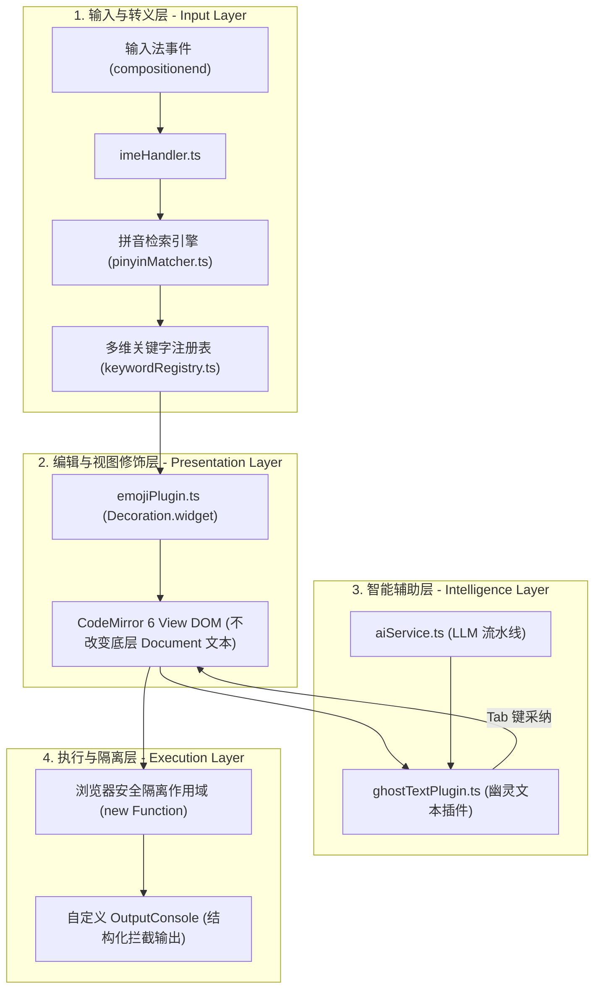

# 访谈研究 04：核心技术架构解析与未来路线图

> **研究主题**：智快马系统工程架构实现与多阶段路线图演进  
> **归档位置**：`.gemini/04_TECHNICAL_ARCHITECTURE_AND_ROADMAP.md`  
> **记录形式**：深度访谈纪要与系统架构白皮书

---

## 🎙️ 访谈实录

**研究员（Interviewer）**：  
从代码实现角度来看，智快马是如何在技术底层做到“让用户输入中文拼音，显示 Emoji 徽标，但运行的依然是标准 JavaScript”的？

**系统架构专家（Expert）**：  
这依赖于我们设计的**四层解耦架构**（Four-Tier Decoupled Architecture）。系统清晰地区分了“输入态”、“视图态”、“运行态”和“智能态”：



---

## 🔬 关键工程实现拆解

### 1. 为什么采用 CodeMirror 6 `Decoration.widget` 而非修改文档文本？
* **传统常见错误**：许多初学者尝试直接将文本替换为带有 Emoji 的字符串（如直接把源码写成 `❓ if (score > 60)`），这会导致 JavaScript 引擎语法解析报错（`SyntaxError: Unexpected token`）。
* **智快马方案**：利用 CodeMirror 6 的高级视图修饰树。文档文本中永远严格存储 `if`、`for`，修饰层仅以视觉微件（Widget）的形式在 AST 对应节点前动态挂载 `<span>❓</span>`。既实现了绚丽的积木感，又保证了文件保存与执行的绝对标准性。

### 2. IME 输入法合成事件的精准拦截
* **工程挑战**：现代中文输入法在输入过程中会频繁触发 `compositionstart`、`compositionupdate` 和 `compositionend`。如果过早替换，会导致输入法候选词框闪烁破损。
* **智快马方案**：通过 `imeHandler.ts`，在 `compositionend` 确认完成的瞬间，结合光标前后的词法上下文进行原子替换（Atomic Transaction），用户毫无卡顿感。

### 3. 多维关键字矩阵设计 (`keywordRegistry.ts`)
* 每一个语法节点抽象为一个完整的多维元对象：
  ```typescript
  export interface KeywordMapping {
    id: string;
    canonical: string;       // 工业标准代码 (e.g. "if")
    emoji: string;           // 呈现给用户的徽章 (e.g. "❓")
    displayName: string;     // 中文主称呼 (e.g. "如果")
    category: 'control' | 'loop' | 'function' | 'variable' | 'literal' | 'io';
    synonyms: {
      chinese: string[];     // 中文口语 (e.g. ["如果", "要是", "假设"])
      pinyinAbbr: string[];  // 简拼 (e.g. ["rg", "ys", "js"])
      pinyinFull: string[];  // 全拼 (e.g. ["ruguo", "yaoshi"])
    };
    snippet: string;         // Tab 补全模板
  }
  ```
  这一数据结构为未来的多语种扩展（日文、韩文、西文）提供了完全解耦的标准元数据契约。

---

## 🗺️ 未来四阶段演进路线图 (Roadmap)

**研究员（Interviewer）**：  
站在“智快马 (a1b2c)”的新定位上，项目未来的演进路线图该如何铺展？

**系统架构专家（Expert）**：  
我们将按照由浅入深、由核心向生态辐射的策略推进：

```
[Phase 1: 语种全球化] ──► [Phase 2: 积木代码双向孪生] ──► [Phase 3: 开发者生态插件] ──► [Phase 4: 教育体系集成]
```

### 阶段一：多语言国际化扩展（Polyglot Localization）
- **目标**：突破中文拼音限制，建立全球母语关键字词典。
- **任务**：
  - 引入日语罗马字（Romaji）与平假名口语映射（如 `ms` $\to$ `moshi` $\to$ `if`）。
  - 引入韩语初声（자음）拼写映射。
  - 抽象多语言提供者协议（`I18nLanguageProvider`），支持社区以 JSON/YAML 贡献新语种。

### 阶段二：积木-代码双向孪生视图（Block-Text Digital Twin）
- **目标**：彻底打通“积木”与“代码”的视觉壁垒。
- **任务**：
  - 引入左右分屏（Split View）：左屏呈现 Scratch/Blockly 风格的彩色积木，右屏呈现智快马编辑器。
  - 实现双向响应同步：在左侧拖拽积木，右侧实时生成带 Emoji 徽标的代码；在右侧修改代码，左侧积木自适应高亮联动。

### 阶段三：开发者与 IDE 生态化（Ecosystem Tooling）
- **目标**：走出独立 Web 端，赋能更广泛的开发工具链。
- **任务**：
  - 将核心转换引擎打包为独立 NPM 库：`@a1b2c/core`。
  - 发布官方 VS Code 扩展：`vscode-a1b2c`，让用户在主流专业编辑器中也能一键开启“智快马过渡模式”。

### 阶段四：趣味教育与关卡设计（Gamified Pedagogy）
- **目标**：从工具延伸为完备的学习平台。
- **任务**：
  - 内置“语法通关任务库”：例如“第 1 关：用 ❓ 拯救小飞马”、“第 2 关：用 🔄 遍历胡萝卜阵列”。
  - 引入智能代码评测与即时反馈，打造寓教于乐的完整闭环。
